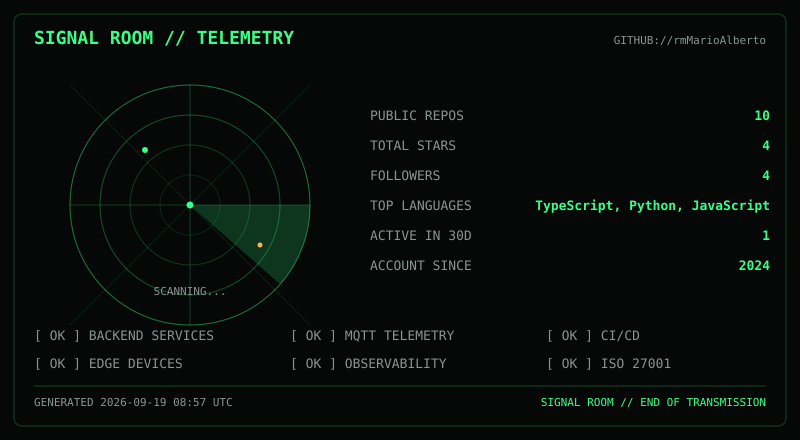
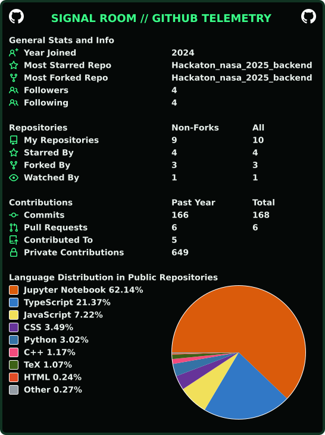

<div align="center">

# SIGNAL ROOM

### BACKEND DEVELOPER · IoT ENGINEER · QUERÉTARO, MX

[](https://github.com/DenverCoder1/readme-typing-svg)

</div>

---

## `> SYSTEM STATUS`

```text
┌──────────────────────────────────────────────────────────────┐
│ SIGNAL ROOM // TELEMETRY CONTROL CENTER                      │
├──────────────────────────────────────────────────────────────┤
│ STATUS        ONLINE                                         │
│ LOCATION      QUERÉTARO, MX                                  │
│ ROLE          BACKEND DEVELOPER / IoT ENGINEER               │
│ FOCUS         DISTRIBUTED SYSTEMS / EDGE / TELEMETRY         │
│ COVERAGE      >80%                                           │
│ DEVICES       50+ CONCURRENT                                 │
│ CERTIFICATION ISO/IEC 27001 · GPA 9.54                       │
└──────────────────────────────────────────────────────────────┘
```

> Building backend systems and connected-device infrastructure where
> telemetry, reliability and security meet. Beca académica en
> **Fraunhofer IIS (Alemania)** con tecnología **MIOTY**.

---

## `> LIVE TELEMETRY`

<p align="center">



</p>

<p align="center">

<a href="https://github.com/cicirello/user-statistician"></a>

</p>

<p align="center">


</p>

---

## `> CORE STACK`


---

## `> OPERATIONS`

```text
[ OK ] BACKEND SERVICES        [ OK ] MQTT TELEMETRY
[ OK ] EDGE DEVICES            [ OK ] CI/CD PIPELINES
[ OK ] CONTAINERIZED DEPLOYS   [ OK ] OBSERVABILITY
[ OK ] SECURITY PRACTICES      [ OK ] CLEAN ARCHITECTURE
```

---

## `> SELECTED PROJECTS`

### `01 // TELEMETRY PLATFORM` — IMOX Cloud

Monitoreo de calidad eléctrica en tiempo real: ESP32-S3 → MQTT → NestJS.
50+ dispositivos concurrentes, OTA remoto, 243+ tests backend.

**Stack:** NestJS · TypeScript · MQTT · ESP32 · Docker · InfluxDB

### `02 // ENTERPRISE B2B` — CEQ Marketplace

Marketplace privado del Clúster Energético de Querétaro. Triple Hélice:
empresas publican ofertas y reciben matches. 565+ tests, Pact y k6.

**Stack:** NestJS · React 19 · PostgreSQL · Redis · MinIO

### `03 // ENTERPRISE SaaS` — Estudio 43

Gestión para clínica de belleza sobre 11 microservicios Spring
con gateway, SSO y React. Scrum Master de equipo de 6.

**Stack:** Spring Boot · React · PostgreSQL · Flyway

### `04 // AI MULTI-AGENT` — VozRural

Telemedicina por voz/WhatsApp para zonas rurales: dos LLMs en pipeline,
latencia <1.5s, wearable GPS PoC. Hackathon Troyano 2026.

**Stack:** FastAPI · Gemini · Groq · ESP32

> [Explora el portfolio completo — SIGNAL ROOM](https://mario-ramirez.dev) ·
> [Repos del portfolio](https://github.com/rmMarioAlberto/mario-ramirez-dev)

---

## `> ENGINEERING METRICS`

| Metric                 | Signal                          |
| ---------------------- | -------------------------------:|
| Code Coverage          | `>80%`                          |
| IoT Concurrent Devices | `50+`                           |
| GPA                    | `9.54`                          |
| MIOTY                  | Fraunhofer IIS · Germany        |
| NASA                   | Space Apps Challenge 2025       |
| IEEE                   | Vice President · UTEQ           |
| Fin 4 All              | Hackathon 2025 · Backend        |

---

## `> RESEARCH / SIGNALS`

```text
MIOTY (LPWAN)
├── Fraunhofer IIS · Germany
├── Beca académica By Excellence
└── Emergencias rurales · Sierra Queretana

IOT TELEMETRY
├── MQTT · LoRaWAN · ESP32
└── Edge computing · OTA updates

ENGINEERING
├── Clean Architecture · CI/CD · Testing
└── ISO/IEC 27001 · OWASP · SonarQube
```

---

## `> CONNECT`

<p align="center">

<a href="https://github.com/rmMarioAlberto"></a>
<a href="https://linkedin.com/in/mario-alberto-ramirez-martinez-12215b34a"></a>
<a href="mailto:rmmarioalberto08@gmail.com"></a>
<a href="https://mario-ramirez.dev"></a>

</p>

---

<div align="center">

```text
SIGNAL ROOM // END OF TRANSMISSION
```


</div>
